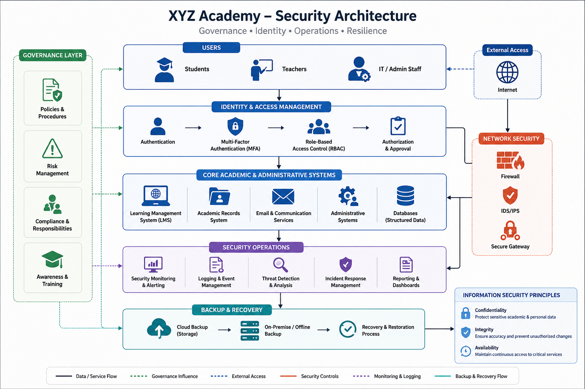
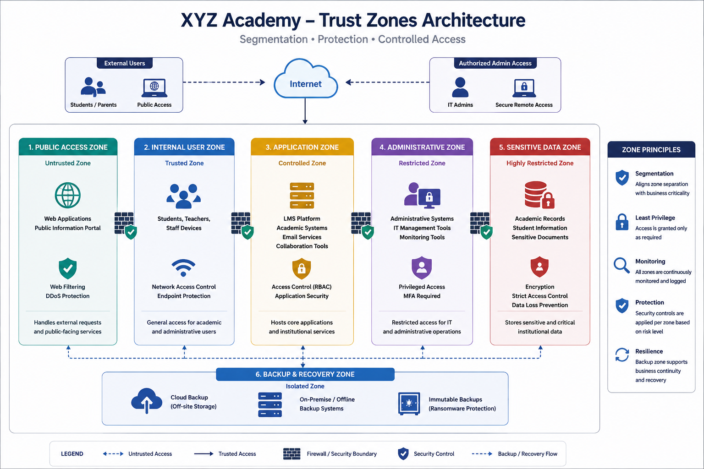
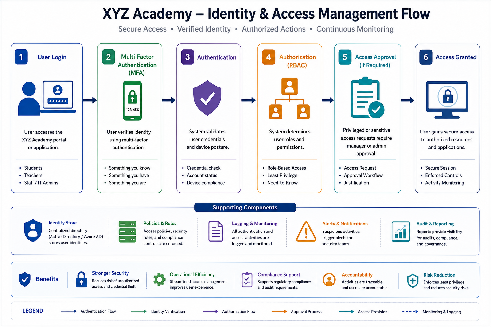
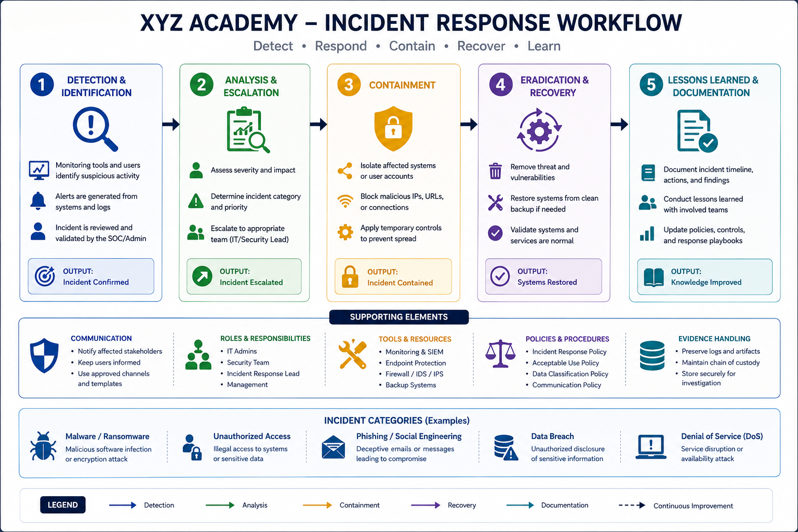
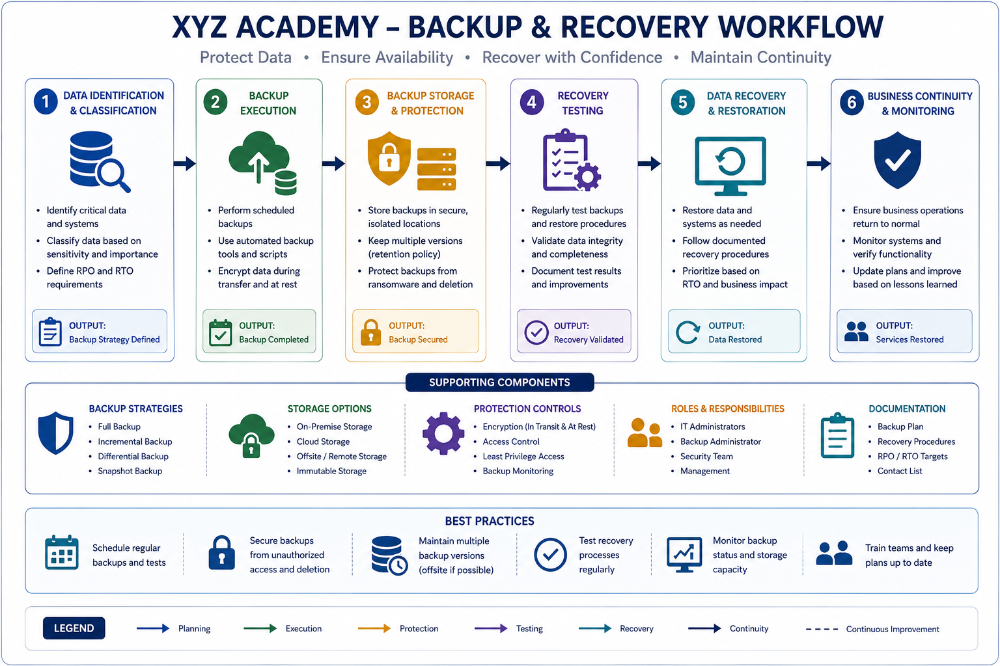

# 🎓 Secure Academic Infrastructure

### Enterprise Security Governance & Operations Simulation for XYZ Academy

A cybersecurity governance and security operations project designed for a medium-sized academic institution.  
This project demonstrates how security governance, risk management, identity protection, incident response, and business continuity practices can be integrated into a realistic academic environment.

---

## 📌 Project Overview

XYZ Academy is a simulated medium-sized educational institution that relies on multiple digital services, including:

- Learning Management Systems (LMS)
- Academic record systems
- Internal communication platforms
- Cloud backup services
- Administrative systems
- Wireless network services

The project focuses on improving organizational cybersecurity operations and strengthening the protection of critical academic assets.

---

## 🎓 Academic Project Development

This project was originally developed as part of the *Information Security Fundamentals* course during the Cybersecurity Diploma program at Imam Mohammad Ibn Saud Islamic University.

The original academic project was later expanded and professionally redesigned into a more structured cybersecurity governance and security operations simulation to improve documentation quality, organizational realism, and portfolio presentation.

The redevelopment process focused on transforming theoretical security concepts into a practical and professionally organized security case study suitable for GitHub portfolio presentation.

---

# 🏗️ Security Architecture



The following diagram represents the simulated cybersecurity architecture for XYZ Academy, including governance-focused security operations, identity management, monitoring activities, and organizational protection layers.

---

# 🔐 Trust Zones Architecture



The trust zones model demonstrates how organizational systems, users, administrative services, and sensitive academic data are logically separated to improve protection, monitoring, and controlled access.

---

# 🔑 Identity & Access Management (IAM)



The IAM workflow demonstrates how authentication, authorization, multi-factor authentication (MFA), and access approval processes support secure access management within the academy environment.

---

# 🚨 Incident Response Workflow



The incident response workflow demonstrates how security events are detected, analyzed, contained, recovered, and documented to support operational security readiness.

---

# 💾 Backup & Recovery Workflow



The backup and recovery workflow demonstrates how organizational data is protected, restored, and monitored to support operational continuity and disaster recovery readiness.

---

## 🛡️ Security Domains Covered

- Security Governance
- Risk Management
- Identity & Access Management (IAM)
- Security Operations & Monitoring
- Incident Response
- Business Continuity & Disaster Recovery
- Security Awareness
- Compliance & Security Policies

---

## 🏫 Infrastructure Scope

| Category | Details |
|---|---|
| Institution Type | Medium-Sized Academic Institution |
| Students | 500–800 |
| Staff Members | 40–70 |
| IT Team | Internal IT & Security Operations Team |
| Core Services | LMS, Email, Academic Records, Cloud Backup |
| Security Maturity | Intermediate |

---

## ⚠️ Simulated Threat Landscape

The environment was designed to address realistic cybersecurity threats commonly targeting educational institutions, including:

- Phishing attacks
- Ransomware infections
- Credential theft
- Malware outbreaks
- Insider misuse
- Unauthorized access attempts
- Service disruptions

---

## 📂 Repository Structure

```txt
secure-academic-infrastructure/
│
├── governance/
├── risk-management/
├── security-operations/
├── business-continuity/
├── architecture/
├── report/
└── assets/
```

---

## 📈 Future Improvements

Potential future enhancements for the project include:

- Expanded security monitoring activities
- Additional incident response scenarios
- Enhanced infrastructure visualization
- Additional governance documentation
- Awareness campaign simulations

---

## 📄 Project Report

The complete cybersecurity governance and operations documentation report is available below.

[View Full Report](report/Secure-Academic-Infrastructure-Report.pdf)

---

## 👨‍💻 Author

**Saad Almutairi**  
Cybersecurity Diploma Student  
Imam Mohammad Ibn Saud Islamic University
